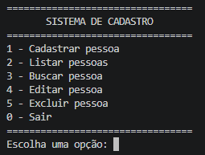

# Sistema de Cadastro em C#
# Sistema de Cadastro

<p>
  
</p>

<p>
  Sistema de cadastro desenvolvido em C# para praticar lógica de programação e conceitos fundamentais de desenvolvimento.
</p>
Projeto desenvolvido em C# com o objetivo de praticar conceitos fundamentais de programação e desenvolvimento de aplicações no console.

## Funcionalidades

* Cadastrar pessoas
* Listar pessoas cadastradas
* Buscar pessoas pelo nome
* Editar pessoas cadastradas
* Excluir pessoas
* Validação de entradas
* Menu interativo no terminal

## Tecnologias utilizadas

* C#
* .NET
* Visual Studio Code

## Conceitos praticados

* Variáveis
* Estruturas condicionais (`if/else`)
* Estrutura de repetição (`while`)
* Laços `for` e `foreach`
* Listas (`List`)
* Métodos de manipulação de listas
* Entrada e saída de dados pelo console
* Validação de dados

## Como executar

1. Clone o repositório.
2. Abra a pasta do projeto no Visual Studio Code.
3. Execute no terminal:

```bash
dotnet run
```

4. Utilize o menu apresentado no terminal.

## Objetivo

Este projeto faz parte do meu processo de aprendizado em C# e .NET, com foco no desenvolvimento de lógica de programação e construção de aplicações práticas.
